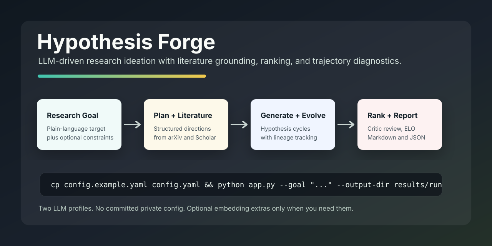

# Hypothesis Forge



Hypothesis Forge is a CLI-first research ideation engine inspired by the AI co-scientist workflow in [arXiv:2502.18864](https://arxiv.org/pdf/2502.18864). It turns a research goal into a structured plan, generates and evolves hypotheses over multiple cycles, grounds ideas with literature search, audits prior art, ranks candidates, and writes reviewable Markdown/JSON reports.

The project is intentionally lightweight: it is built for local experimentation, reproducible idea sweeps, and quick inspection of how a pool of research hypotheses changes over time.

For agents: copy `config.example.yaml` to `config.yaml`, set `thinking_llm` and `critic_llm`, then run `python app.py --goal "YOUR_RESEARCH_GOAL" --output-dir results/YOUR_RUN`.

## What It Does

- Builds a structured research plan from a plain-language goal.
- Generates fresh hypotheses and evolves high-scoring candidates across cycles.
- Retrieves literature from Semantic Scholar and arXiv for grounding.
- Runs larger-pool prior-art checks to catch duplicate or weakly differentiated ideas.
- Reviews hypotheses with separate critic/ranking agents.
- Tracks trajectory quality, diversity, stability, and failure modes.
- Saves timestamped reports plus live checkpoints for long runs.

## Repository Layout

```text
.
├── app.py                    # CLI entrypoint
├── app/                      # Workflow, agents, prompts, models, tools
├── config.example.yaml       # Public configuration template
├── docs/assets/              # README and documentation assets
├── run_configs/              # Optional constraint/profile examples
├── tests/                    # Unit tests
├── trajectory_sweep.py       # Optional sweep runner for trajectory/debug profiles
├── Makefile
└── README.md
```

Local-only files such as `config.yaml`, `.cache/`, virtual environments, and `results/` are ignored by git.

## Installation

Use Python 3.10+.

```bash
git clone https://github.com/deadpoppy/hypothesis-forge.git
cd hypothesis-forge
python -m venv .venv
source .venv/bin/activate
pip install -r requirements.txt
```

The install includes `sentence-transformers` and `torch` because prior-art recall and hypothesis proximity scoring use semantic embedding similarity for the full workflow. `scikit-learn` and `numpy` are not listed directly because the repository code does not import them.

## Configuration

Create a private local config from the public template:

```bash
cp config.example.yaml config.yaml
```

Only two LLM profiles are required:

```yaml
thinking_llm:
  api_key: null
  base_url: "https://api.openai.com/v1"
  model: "gpt-4.1"
  model_fallbacks: []

critic_llm:
  api_key: null
  base_url: "https://api.openai.com/v1"
  model: "gpt-4.1"
  model_fallbacks: []
```

`thinking_llm` handles planning, hypothesis generation, evolution, literature query planning, and prior-art repair. `critic_llm` handles safety checks, reflection, pairwise ranking, and meta-review. The two profiles may point to the same provider and model.

You can put keys in `config.yaml`, but environment variables are safer:

```bash
export THINKING_LLM_API_KEY="your_thinking_key"
export CRITIC_LLM_API_KEY="your_critic_key"
```

For single-provider runs, `LLM_API_KEY` is also accepted as a shared fallback. Do not commit `config.yaml`.

Semantic similarity is enabled by default:

```yaml
sentence_transformer_enabled: true
sentence_transformer_local_files_only: true
```

Keep `sentence_transformer_local_files_only: true` when the embedding model is already cached locally. Set it to `false` for a first run that should download `all-MiniLM-L6-v2`.

## Quick Start

With the default run settings in `config.yaml`, a normal run only needs a goal and output directory:

```bash
python app.py \
  --goal "Generate strong research ideas for compressed trajectory representations in multimodal embodied agents, focusing on separating noise from meaningful structure in action/state trajectories and using compression to improve planning, generalization, and policy quality." \
  --output-dir results/trajectory_compression_c6650
```

The default template currently uses:

```yaml
cycles: 5
num_hypotheses: 5
top_k_hypotheses: 3
ranking_matches_per_cycle: 1000
deep_review_top_k: 3
max_literature_results: 6
max_concurrency: 16
```

You can override any of these from the CLI when needed:

```bash
python app.py \
  --goal "Study robust evaluation methods for AI scientific hypothesis generation" \
  --cycles 1 \
  --num-hypotheses 2 \
  --ranking-matches-per-cycle 3 \
  --deep-review-top-k 1 \
  --output-dir results/smoke_test
```

The Makefile wrapper is useful for short goals:

```bash
make run GOAL="Study robust evaluation methods for AI scientific hypothesis generation" OUTPUT_DIR=results/smoke_test
```

## Outputs

Each run writes:

- `co_scientist_run_YYYY-MM-DD_HH-MM-SS.json`
- `co_scientist_run_YYYY-MM-DD_HH-MM-SS.md`
- `checkpoint_latest.json`
- `checkpoint_latest.md`

The Markdown report is usually the easiest artifact to inspect first. The JSON report contains the full cycle history, per-step diagnostics, and final context memory.

## Analysis Tools

The `app/trajectory.py`, `app/evolution_analysis.py`, `trajectory_sweep.py`, and `run_configs/trajectory_profiles.json` files are optional diagnostics for understanding how hypothesis pools evolve. They are useful when you want to compare exploration settings, check lineage stability, or debug why a run converged too quickly.

Trajectory analysis:

```bash
python -m app.trajectory results/
```

Save trajectory analysis artifacts:

```bash
python -m app.trajectory results/ \
  --markdown-out results/trajectory_summary.md \
  --json-out results/trajectory_summary.json
```

Deep evolution analysis:

```bash
python -m app.evolution_analysis results/
```

Trajectory sweep command generator:

```bash
python trajectory_sweep.py \
  --goal "YOUR_RESEARCH_GOAL" \
  --constraints run_configs/llm_inference_10_direction_constraints.json
```

## Tests

```bash
make test
```

Equivalent:

```bash
python -m unittest discover -s tests
```

## Operational Notes

- arXiv `429` responses trigger a cooldown saved at `arxiv_state_path`.
- Semantic Scholar is optional. Without an API key, the workflow uses unauthenticated rate limits or continues with the remaining sources.
- `sentence_transformer_local_files_only: true` requires the configured embedding model to already exist locally; otherwise similarity falls back to lexical matching.
- Set `max_literature_results: 0` for LLM-only smoke tests without live literature grounding.

## Scope

Hypothesis Forge is a research ideation and review assistant, not an autonomous scientific authority. Generated ideas should be treated as candidates for expert review, implementation, and empirical validation.
